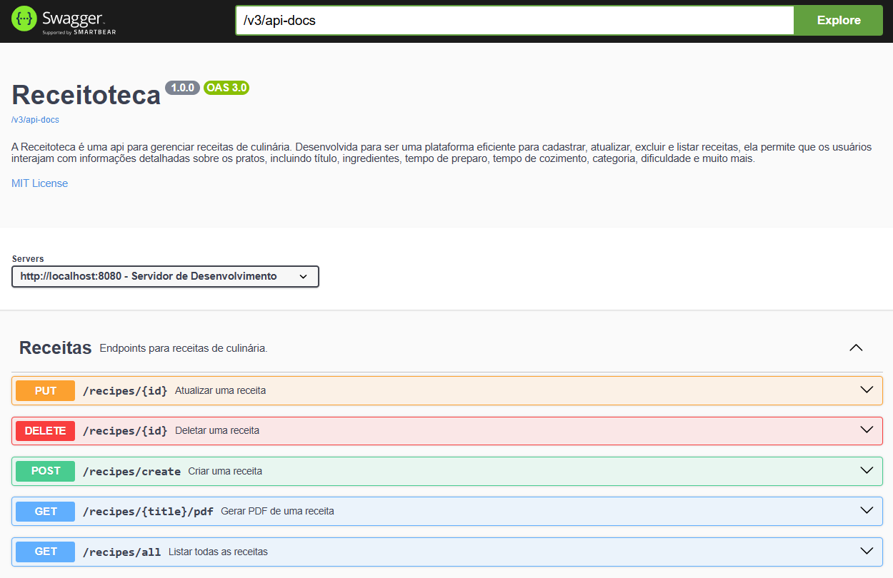

<h1 align="center">
  Receitoteca 🍴
  <p>
    
    
    
  </p>
</h1>

Receitoteca é uma API para gerenciar receitas de culinária. Ela permite aos usuários cadastrar, atualizar, excluir e listar receitas, com informações detalhadas sobre os pratos, como título, ingredientes, tempo de preparo, categoria, dificuldade e muito mais.

## 🚀 Tecnologias Utilizadas

- **Backend**: Spring Boot
- **Banco de Dados**: PostgreSQL
- **Dependências Principais**:
  - Spring Boot Starter Web
  - Spring Boot Starter Data JPA
  - PostgreSQL Driver
  - Lombok
  - Swagger (OpenAPI) para documentação
  - iText (para geração de PDFs)

## 🔄 Funcionalidades

A API expõe endpoints RESTful para realizar operações CRUD (Criar, Ler, Atualizar, Deletar) nas receitas de culinária, além de permitir a geração de PDFs com os detalhes das receitas. A seguir, estão os principais endpoints:

### 📚 Endpoints

#### **Receitas**

- **GET /recipes/all**: Retorna todas as receitas cadastradas.
- **POST /recipes/create**: Cria uma nova receita.
- **PUT /recipes/{id}**: Atualiza uma receita existente.
- **DELETE /recipes/{id}**: Deleta uma receita.
- **GET /recipes/{title}/pdf**: Gera um PDF contendo os detalhes de uma receita, com base no título.

#### **Exemplo de Receita 🍰**

A receita possui os seguintes atributos:

```json
{
  "id": 1,
  "title": "Bolo de Chocolate",
  "ingredients": ["Farinha", "Ovos", "Chocolate"],
  "preparation": "1. Preaqueça o forno a 180°C. 2. Em uma tigela, misture os ingredientes secos. 3. Adicione os ovos e o chocolate derretido, mexendo bem. 4. Despeje a massa em uma forma untada. 5. Leve ao forno por 40 minutos ou até que, ao enfiar um palito, ele saia limpo. 6. Deixe esfriar e sirva.",
  "imgUrl": "http://image.url",
  "prepTime": 30,
  "cookTime": 40,
  "category": "DESSERTS",
  "difficulty": "EASY"
}

```

## ⚠️ Exceções Personalizadas
O projeto inclui exceções personalizadas para gerenciar erros específicos, como:

+ RecipeNotFoundException: Lançada quando a receita não é encontrada.
+ DuplicateRecipeException: Lançada quando uma receita duplicada é criada.
+ InvalidRecipeException: Lançada quando a receita não é válida.

## 📖 Documentação

A API utiliza Swagger para documentar e testar os endpoints de forma interativa.
<div align="center">
  
</div>

### Descrição dos Endpoints no Swagger

- **Listar todas as receitas**: Retorna uma lista com todas as receitas cadastradas.
- **Criar uma receita**: Cria uma nova receita com os detalhes fornecidos.
- **Atualizar uma receita**: Atualiza uma receita existente pelo ID.
- **Deletar uma receita**: Exclui uma receita existente pelo ID.
- **Gerar PDF de uma receita**: Gera um arquivo PDF com os detalhes de uma receita.

## 🗂️ Estrutura do Projeto

O projeto está organizado da seguinte forma:
```
src/
├── main/
│   ├── java/
│   │   ├── com/
│   │   │   ├── me/
│   │   │   │   ├── Receitoteca/
│   │   │   │   │   ├── config/         # Configurações (ex: SwaggerConfig)
│   │   │   │   │   ├── controllers/    # Controladores de API
│   │   │   │   │   ├── dtos/           # Objetos de transferência de dados
│   │   │   │   │   ├── entities/       # Entidades JPA
│   │   │   │   │   ├── enums/          # Enum com as opções de categorias e dificuldades 
│   │   │   │   │   ├── exceptions/     # Exceções personalizadas
│   │   │   │   │   ├── infra/          # Tratamento global de exceções
│   │   │   │   │   ├── mapper/         # Mapeamento entre DTOs e entidades
│   │   │   │   │   ├── services/       # Lógica de negócios
```
## 🛠️ Como Rodar o Projeto

Clone o repositório:

```
git clone https://github.com/Francine02/Receitoteca.git
```

Acesse o diretório do projeto:

```
cd Receitoteca
```

Compile e rode o projeto.

Acesse a API em http://localhost:8080

## 🤝 Contribuindo
1. Faça um fork deste repositório.
2. Crie uma branch para a sua feature (git checkout -b feature-nome-da-feature).
3. Faça o commit das suas alterações (git commit -m 'Adiciona nova feature').
4. Envie para o repositório remoto (git push origin feature-nome-da-feature).
5. Crie um novo Pull Request.

## 📝 Licença

Este projeto está licenciado sob a **MIT License**. Consulte o arquivo [LICENSE](LICENSE) para mais detalhes.
